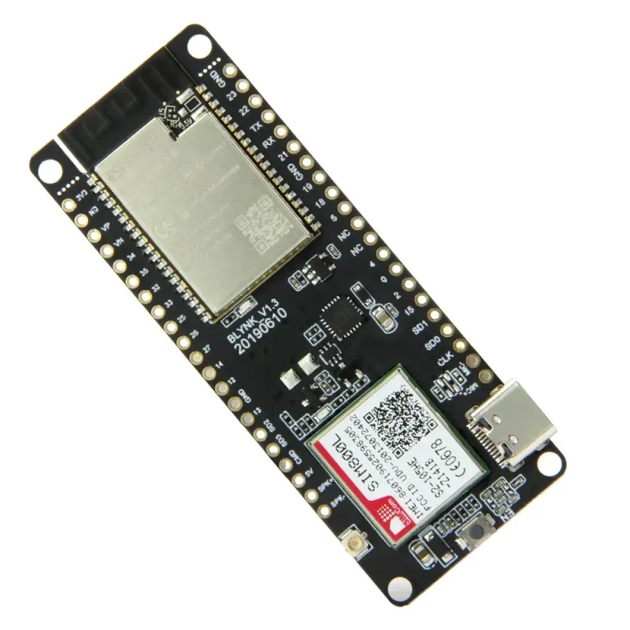

# Smart Fish BD IoT(Hardware & Firmware) Project 

This project consists of three main devices:

1. **SFBD_Gateway**  
2. **SFBD_Sensor_Unit**  
3. **SFBD_Switching_Unit**  

All codes are written using the Arduino IDE. The E32 module serves as the common communication hardware for all three devices. You can find more details about the E32 module [here](https://www.bdtronics.com/e32-433t30d-lora-433mhz-sx1278-10km-wireless-transmitter-and-receiver-uart-rf-module.html?srsltid=AfmBOorOa9TfIWnLV8HoBnj7h4TW5uTZ1eW8SMQNh-CtPJsR8A7NeHYj).

## 1. SFBD_Gateway

For the gateway unit, the TTGO T-Call ESP32 wireless module was used.  
[TTGO T-Call ESP32 Module](https://store.roboticsbd.com/communication-module/1412-ttgo-t-call-esp32-wireless-module-gprs-antenna-sim-card-sim800l-board-robotics-bangladesh.html)




## 2. SFBD_Switching_Unit

The switching unit uses the STM32 Bluepill microcontroller:  
[STM32 Bluepill](https://store.roboticsbd.com/development-boards/350-stm32f103c8t6-blue-pill-development-board-robotics-bangladesh.html)


Additionally, it uses relay modules for switching:

- [8-Channel Relay Module](https://store.roboticsbd.com/relay/1948-8-channel-5v-relay-module-robotics-bangladesh.html)  


- [4-Channel Relay Module](https://store.roboticsbd.com/robotics-parts/409-4-channel-5v-relay-board-module-robotics-bangladesh.html)  


## 3. SFBD_Sensor_Unit

The sensor unit also uses the STM32 Bluepill microcontroller. This unit includes several sensors:

1. [DS18B20 Temperature Sensor](https://store.roboticsbd.com/robotics-parts/414-waterproof-ds18b20-digital-thermal-probe-or-sensor-robotics-bangladesh.html)
2. [DFRobot Dissolved Oxygen Sensor](https://techshopbd.com/detail/3472/Gravity:_Analog_Dissolved_Oxygen_Sensor___Meter__Kit_For_Arduino_techshop_bangladesh)
3. [DFRobot pH Sensor/Meter Kit V2](https://techshopbd.com/detail/3366/Gravity:_Analog_pH_Sensor_Meter_Kit_V2_techshop_bangladesh)
4. [Rain Sensor](https://techshopbd.com/detail/3502/Rain_Sensor_Module_techshop_bangladesh)
5. [DFRobot TDS Sensor/Meter for Arduino](https://techshopbd.com/detail/3294/Gravity:_Analog_TDS_Sensor_Meter_for_Arduino_techshop_bangladesh)


### Sensor Calibration

1. **pH Sensor:** Calibrated using the process described [here](https://wiki.dfrobot.com/Gravity__Analog_pH_Sensor_Meter_Kit_V2_SKU_SEN0161-V2).
2. **DO Sensor:** Calibrated using the two-point calibration method from [this link](https://wiki.dfrobot.com/Gravity__Analog_Dissolved_Oxygen_Sensor_SKU_SEN0237).
3. **TDS Sensor:** Calibrated using the process described [here](https://wiki.dfrobot.com/Gravity__Analog_TDS_Sensor___Meter_For_Arduino_SKU__SEN0244). A known TDS meter value was used as a reference for calibration.
4. **Temperature Sensor:** Corrected using a real thermometer by tweaking the constant value in the line:

    ```cpp
    temp = TempRead() * 0.0625;
    ```

   (Reference: `SFBD_sensor_unit/temperature.ino` line 4 in this GitHub project).

## Installing Dependencies for Arduino IDE

To use these codes in the Arduino IDE, you need to install the **ESP32** and **STM32** board support packages. Follow the instructions below:

1. Open Arduino IDE.
2. Go to **File > Preferences**.
3. In the "Additional Boards Manager URLs" field, add the following URLs:

    ```
    https://github.com/stm32duino/BoardManagerFiles/raw/main/package_stmicroelectronics_index.json
    https://raw.githubusercontent.com/espressif/arduino-esp32/gh-pages/package_esp32_index.json
    ```

4. Go to **Tools > Board > Boards Manager**, search for "ESP32" and "STM32", and install the respective packages.

### Selecting the Correct Board

- For the **gateway** codes, select the board: **ESP32 > ESP32 Wrover Module**.
- For the **sensor unit** and **switching unit** codes, select the board: **STM32 MCU based Board > Generic STM32F1 series**.

Upload the codes to their respective devices, and you're done!

## Gateway Configuration

**There are 2 cases:**

1. **If your device is brand new**, the following video is enough to configure.  
   You can find the gateway configuration guide video [here](https://drive.google.com/file/d/18WGI2CXndcDLMi8Di_tGigBhUmnVskKT/view?usp=sharing).

2. **If your device was connected to any WiFi previously and now you need to configure it again**, follow the steps:  
   i.   
      See the marked area in the photo. There is a button that needs to be pressed with a pen for a minimum of **10 seconds**.

   ii. Now, follow the gateway configuration guide video [here](https://drive.google.com/file/d/18WGI2CXndcDLMi8Di_tGigBhUmnVskKT/view?usp=sharing).

## Circuit Board

All circuits were designed using an open-source software called Fritzing. You can download Fritzing from [this link](https://drive.google.com/file/d/1iceu7ZeL34dju8lppnuAEAwVtYvj-atZ/view?usp=sharing). The `.fzz` files in the repository are the Fritzing files.

Inside each folder, there is a zip file. Upload this zip file to TechShopPCB, and the circuit board manufacturing process is complete.
